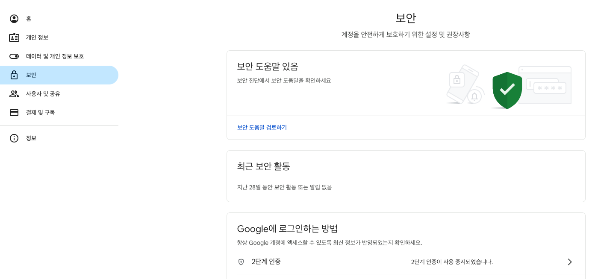
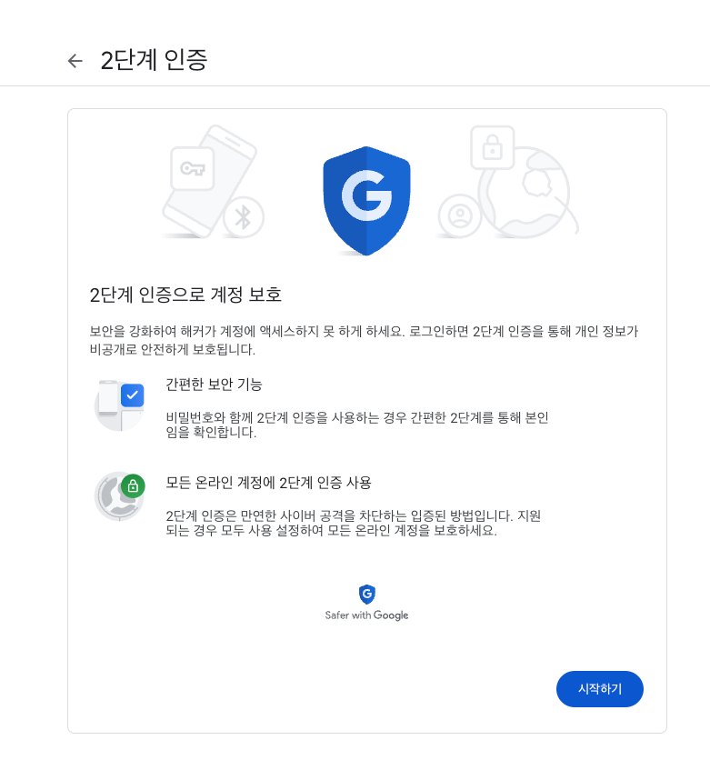
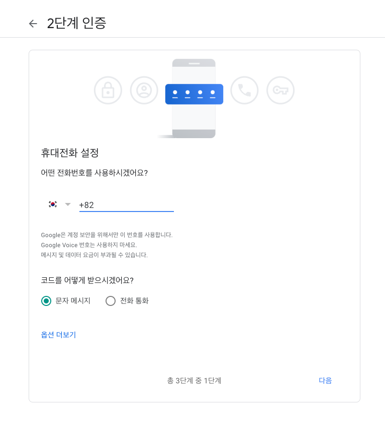
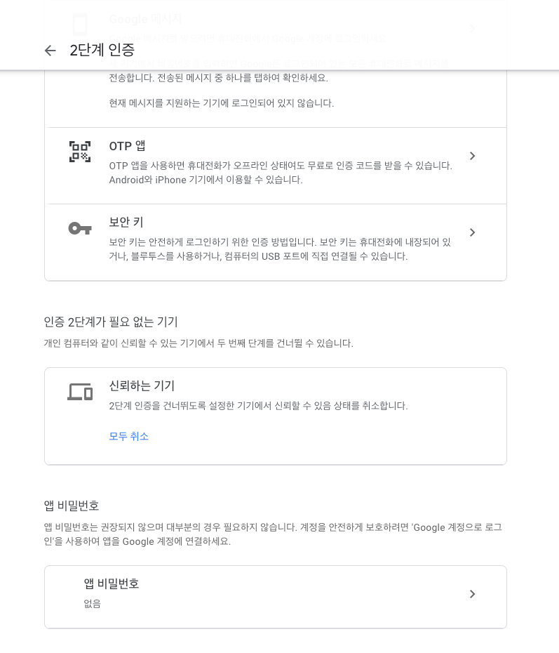
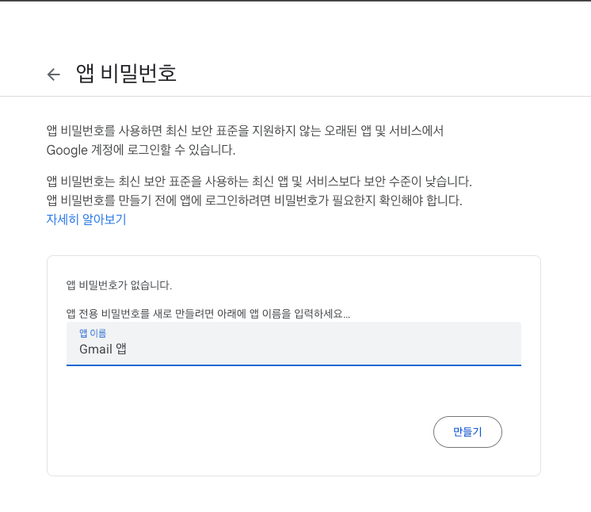
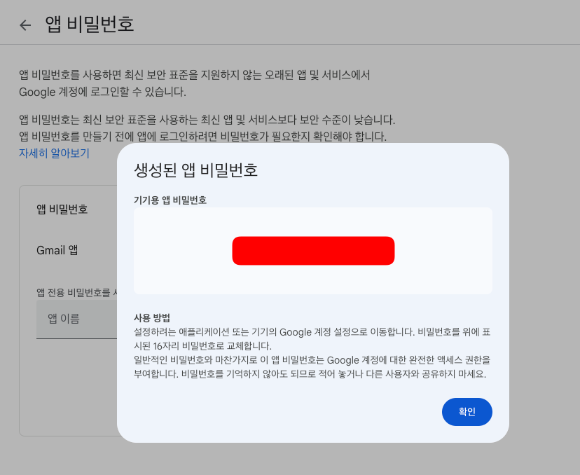

# 알림 기능 추가하기 - Email

Jakarta Mail 패키지를 활용하면 Java 프로젝트에서 이메일을 전송할 수 있다.
이 Jakarta Mail 패키지를 편하게 사용할 수 있는 Spring Boot Starter Mail을 추가한다.

```groovy
    implementation 'org.springframework.boot:spring-boot-starter-mail'
```

메일 전송을 위해선 SMTP 서버가 있어야 하는데, 여기서는 Gmail의 SMTP 서버를 활용한다.
이를 위해서는 Gmail의 2단계 인증을 활성화 하고, App 키를 발급받는 것이 좋다.
App 키를 발급받지 않으면 메일을 보내기 위해 Gmail의 실제 비밀번호를 작성해주어야 한다.

https://myaccount.google.com/security







App 키는 그 자체로 비밀번호의 역할을 겸하기 때문에 절대 공개되어선 안된다.

이를 `application.yaml`에 등록하면, Spring Boot 내부적으로 설정이 진행된다.
여기에 추가적으로 Gmail을 사용하기 위한 추가 설정이 포함된다.

```yaml
spring:
  # ...
  mail:
    host: smtp.gmail.com
    port: 587
    username: <username>
    password: <password>
    properties:
      mail:
        smtp:
          auth: true
          starttls:
            enable: true
    protocol: smtp

```

## `AlertService`

알림이 가야되는 상황은 총 5가지로 분류할 수 있으며, 상황에 따라 Email 외의 다른 방식으로 알림을
전송하고 싶을 수 있다. 그래서 알림을 보내는 기능이 갖춰야할 정보를 가진 `AlertService`를 인터페이스로 만들고,

```java
public interface AlertService {
    void sendValidation(UserEntity user, String validationCode);
    void sendOfferAlert(Long itemId, Integer price);
    void sendOfferAcceptedAlert(Long offerId);
    void sendTradeEndAlert(Long offerId);
    void sendPurchaseAcceptAlert(Long orderId);
}
```

이를 구현하는 `AlertEmailService`를 만들어 사용한다. 이때 실제로 메일을 보내는 기능은
각각 메서드가 동일한 만큼, 따로 분리해서 활용이 가능하다.

```java
@Slf4j
@Service
@RequiredArgsConstructor
public class AlertEmailService implements AlertService {
    private final TradeItemRepo itemRepo;
    private final JavaMailSender emailSender;
    private final TradeOfferRepo offerRepo;
    private final ShopItemOrderRepo orderRepo;

    @Override
    public void sendValidation(UserEntity user, String validationCode) {
        // ...
    }

    @Override
    public void sendOfferAlert(Long itemId, Integer price) {
        // ...
    }

    @Override
    public void sendOfferAcceptedAlert(Long offerId) {
        // ...
    }

    @Override
    public void sendTradeEndAlert(Long offerId) {
        // ...
    }

    @Override
    public void sendPurchaseAcceptAlert(Long orderId) {
        // ...
    }

    private void sendMail(
            String to,
            String subject,
            String text
    ) {
        SimpleMailMessage mailMessage = new SimpleMailMessage();
        mailMessage.setTo(to);
        mailMessage.setSubject(subject);
        mailMessage.setText(text);
        emailSender.send(mailMessage);
    }
}
```

이후 알림이 필요한 장소에 적절히 배치할 수 있다.

## 사용자 이메일 인증

현재 비활성 사용자가 일반 사용자로 전환되는 시점은 모든 정보를 제공하는 시점이다.
이때 바로 사용자 전환을 진행하는 대신 이메일을 보내도록 조정할 수 있다.
인증요청을 보냈다는 사실과 인증코드를 기록할 수 있도록 `Entity`를 구성해주어야 한다.

```java
@Getter
@Builder
@NoArgsConstructor
@AllArgsConstructor
@Entity
public class Validation extends BaseEntity {
    @ManyToOne(fetch = FetchType.LAZY)
    private UserEntity user;
    private String validation;
    private Boolean validated;
}
```

```java
@Slf4j
@Service
@RequiredArgsConstructor
public class UserService implements UserDetailsService {
    private final AuthenticationFacade authFacade;
    private final UserRepo userRepo;
    private final ValidationRepo validationRepo;
    private final UserUpgradeRepo userUpgradeRepo;
    private final CaptchaRepo captchaRepo;
    private final NcpCaptchaService captchaService;
    private final AlertService alertService;

    // ...
    @Transactional
    public UserDto updateUser(UpdateUserDto dto) {
        UserEntity userEntity = authFacade.extractUser();
        userEntity.setAge(dto.getAge());
        userEntity.setPhone(dto.getPhone());
        userEntity.setEmail(dto.getEmail());
        if (
                userEntity.getAge() != null &&
                        userEntity.getEmail() != null &&
                        userEntity.getPhone() != null &&
                        userEntity.getRoles().equals("ROLE_INACTIVE")
        ) {
            String validationCode = UUID.randomUUID().toString().split("-")[0];
            validationRepo.save(Validation.builder()
                    .user(userEntity)
                    .validation(validationCode)
                    .validated(false)
                    .build());
            alertService.sendValidation(userEntity, validationCode);
        }
        return UserDto.fromEntity(userRepo.save(userEntity));
    }
}
```

메일을 보낼때는 내용에 링크를 포함시켜 클릭하면 바로 활성화 되도록 한다.

```java
@Slf4j
@Service
@RequiredArgsConstructor
public class AlertEmailService implements AlertService {

    @Override
    public void sendValidation(UserEntity user, String validationCode) {
        if (!user.getRoles().equals("ROLE_INACTIVE"))
            throw new ResponseStatusException(HttpStatus.BAD_REQUEST);

        sendMail(
                user.getEmail(),
                "이메일 인증 요청",
                String.format("인증링크: http://localhost:8080/users/validate?code=%s", validationCode)
        );
    }
}
```

지금은 클릭하여도 동작하지 않지만, 프런트가 같이 있는 경우 저장된 JWT를 요청을 보내는 과정에 포함시키기 때문에
인증이 진행된다.

```java
@Slf4j
@Service
@RequiredArgsConstructor
public class UserService implements UserDetailsService {
    // ...
    @Transactional
    public UserDto validate(String code) {
        UserEntity user = authFacade.extractUser();
        if (!user.getRoles().equals("ROLE_INACTIVE"))
            throw new ResponseStatusException(HttpStatus.FORBIDDEN);
        Validation validation = validationRepo.findTopByUserIdOrderByCreatedAtDesc(user.getId())
                .orElseThrow(() -> new ResponseStatusException(HttpStatus.BAD_REQUEST));
        if (validation.getCreatedAt().isBefore(LocalDateTime.now().minusMinutes(10)))
            throw new ResponseStatusException(HttpStatus.BAD_REQUEST);
        if (validation.getValidation().equals(code)) {
            user.setRoles("ROLE_ACTIVE");
            return UserDto.fromEntity(userRepo.save(user));
        } else throw new ResponseStatusException(HttpStatus.FORBIDDEN);
    }
}
```

인증을 하는데는 시간제한이 있기 때문에, 다시 인증을 시도하는 기능도 포함시켜야 한다.

```java
@Slf4j
@Service
@RequiredArgsConstructor
public class UserService implements UserDetailsService {
    // ...
    public void requestValidate() {
        UserEntity userEntity = authFacade.extractUser();
        if (
                userEntity.getAge() != null &&
                        userEntity.getEmail() != null &&
                        userEntity.getPhone() != null &&
                        userEntity.getRoles().equals("ROLE_INACTIVE")
        ) {
            String validationCode = UUID.randomUUID().toString().split("-")[0];
            validationRepo.save(Validation.builder()
                    .user(userEntity)
                    .validation(validationCode)
                    .validated(false)
                    .build());
            alertService.sendValidation(userEntity, validationCode);
        } else throw new ResponseStatusException(HttpStatus.FORBIDDEN);
    }
}
```